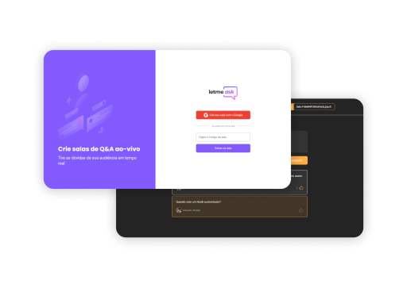
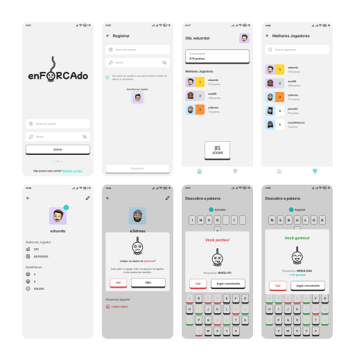

<h1>👋🏼 $\color{#ffffff}{\texttt{Olá, me chamo}}$ $\color{#0afa0a}{\texttt{Edu}}$</h1>
<h3>👨🏻‍💻 $\color{#ffffff}{\texttt{Sou um}}$ $\color{#d5fa43}{\texttt{<}}$ $\color{#0afa0a}{\texttt{Desenvolvedor Fullstack}}$ $\color{#d5fa43}{\texttt{ />}}$</h3>
  
<h2>🙋🏻‍♂️ Sobre mim</h2>

Sou um desenvolvedor apaixonado por criação de Apps e Sites. Meu objetivo é oferecer soluções que não apenas resolvem algum problema, como também façam isso de uma forma elegante e funcional, através de interfaces agradáveis, otimizadas, e com ótima experiência de uso.

<h2>💼 Experiência profissional</h2>

Tenho experiência em desenvolvimento de Apps e Sites, majoritariamente com React e React Native, por quase 2 anos como freelancer. Hoje estou trabalhando em uma startup como desenvolvedor fullstack, criando desde os protótipos dos projetos devido aos meus conhecimentos de design, e atuando em toda a parte técnica, desde os Apps e Sites, como os servidores e banco de dados.

Durante minha jornada, aprendi a desenvolver apps com foco em interfaces agradáveis, e pensando sempre na em uma boa experiência para o usuário final.

<!-- <h2>Meu status do GitHub</h2>

 -->

<h2>👨🏻‍💻 Linguagens de programação mais usadas</h2>

<h2>⚒️ Conheça alguns de meus projetos</h2>

| Let Me Ask | EnForcado |
| :---: | :---: |
|  |   |
